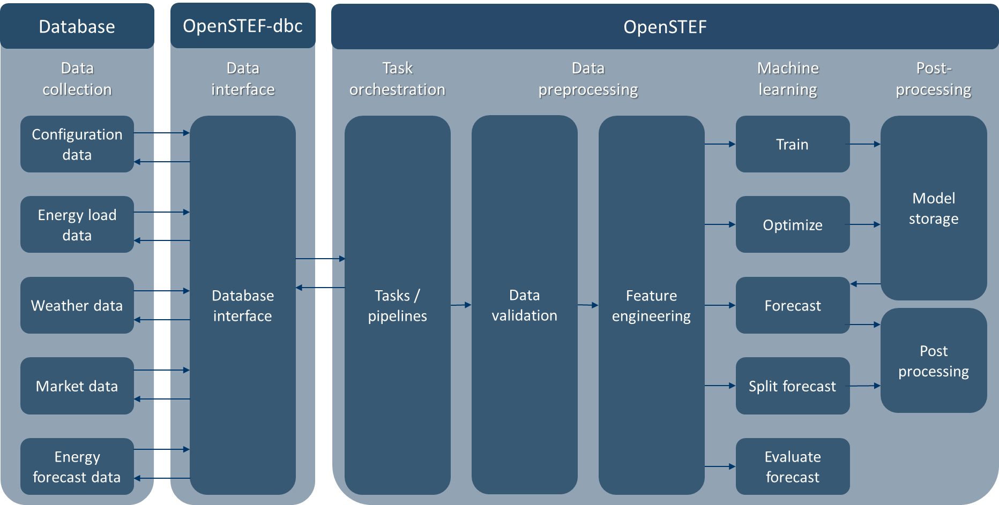

.. comment:
    SPDX-FileCopyrightText: 2017-2023 Contributors to the OpenSTEF project <openstef@lfenergy.org>
    SPDX-License-Identifier: MPL-2.0

.. _concepts:

Architecture, Methodology, and Components
========

Understanding the architecture of OpenSTEF will help you gain insight on how to use this software package
and better understand the rest of the documentation.

Software architecture
---------------------
OpenSTEF is set up as a Python package that performs machine learning in order to forecast energy loads on the energy grid.

OpenSTEF contains:

* **Prediction job**: input configuration for a task and/or pipeline
  (e.g. train an XGB model for a certain location).
* **Tasks**: can be called to perform training, forecasting, or evaluation.
  All tasks use corresponding pipelines. Tasks include getting data from a database,
  raising task exceptions, and writing data to a database.
* **Pipelines**: can be called to perform training, forecasting or evaluation by
  giving input data to the pipeline. Users can choose to use tasks
  (which fetch/write data for you), or use pipelines directly
  (which requires fetching/writing data yourself).
* **Data validation**: is called by pipelines to validate data (e.g. checking for flatliners).
* **Feature engineering**: is called by pipelines to select required features for training/forecasting based on the configuration from the prediction job (e.g. create new features for energy load of yesterday, last week).
* **Machine learning**: is called by pipelines to perform training, forecasting, or evaluation based on the configuration from the prediction job (e.g. train an XGB quantile model).
* **Model storage**: is called by pipelines to store or fetch trained machine learning model with MLFlow (e.g. store model locally in disk/database/s3_bucket on AWS).
* **Post processing**: is called by pipelines to post process forecasting (e.g. combine forecast dataframe with extra configuration information from prediction job or split load forecast into solar, wind, and energy usage forecast).

Tasks are provided in a separate Python package called `openstef-dbc <https://pypi.org/project/openstef-dbc/>`_. If you need to use tasks, the openstef-dbc package is required in order to interface to databases for reading/writing.
Currently, openstef-dbc supports interfaces for a MySQL database for configuration data (e.g. information for prediction jobs) and `InfluxDB <https://www.influxdata.com/>`_ for feature data (e.g. weather, load, energy price data) and energy forecast data.

|

.. include:: methodology_train_predict.rst

|

.. _application-architecture:

Application architecture
------------------------

OpenSTEF is simply a software package (i.e. a Python library). If you're looking to run it as a full application with a graphical user interface frontend, you must deploy it with additional components.

.. image:: https://user-images.githubusercontent.com/25053215/184536367-c7914697-7a2a-45b8-b447-36aec1a6c1af.png
  :width: 800

Here are the recommended additional components if you want to run it as an application:

* Github repositories:

  * (create yourself) **Data fetcher**: software package to fetch input data and write it to a database (e.g. a scheduled `CronJob <https://kubernetes.io/docs/concepts/workloads/controllers/cron-jobs/>`_ to fetch weather data in Kubernetes).
  * (create yourself) **Data API**: API to provide data from a database or other source to applications and users (e.g. a REST API).
  * (create yourself) **Forecaster**: software package to fetch config/data and run OpenSTEF tasks/pipelines (e.g. a scheduled cron job to train/forecast in Kubernetes).
  * (open source) **OpenSTEF**: software package that performs machine learning to forecast energy loads on the energy grid.
  * (open source) **OpenSTEF-dbc**: software package that provides interface to read/write data from/to a database for openstef tasks.

* CI/CD Infrastructure

  * (create yourself) **Energy forecasting Application CI/CD**: Continuous Integration/Continuous Delivery pipeline to build, test, and deploy your forecasting application (e.g. to Kubernetes via Jenkins, Chef, Puppet, Tekton, etc.).
  * (open source) **OpenSTEF package CI/CD**: A set of GitHub Actions that build, test, and publish the OpenSTEF package to PyPI `here <https://pypi.org/project/openstef/>`_ when it is time to release a new version.

* **Compute**: compute resources to run your pipelines and tasks in production (e.g. on Kubernetes using any of the various providers AWS, Azure, GCP, Linode, etc.).
* **Database**: SQL, InfluxDB, or other database that stores fetched input data and forecasts.
* **Dashboard**: graphical user interface dashboard that allows uers to visualize application data (e.g. historic and forecasted energy loads)

.. include:: dashboard.rst

|

.. include:: dazls.rst

|

.. include:: sql_database_diagram.rst

|

.. include:: influx_database_diagram.rst
