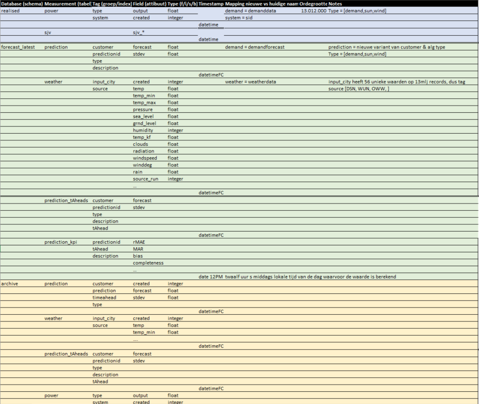

.. comment:
    SPDX-FileCopyrightText: 2017-2023 Contributors to the OpenSTEF project <openstef@lfenergy.org>
    SPDX-License-Identifier: MPL-2.0

Overview of timeseries database schema
============================================================

OpenSTEF uses a timeseries database to store all timeseries data. A diagram of its structure is shown bellow.

