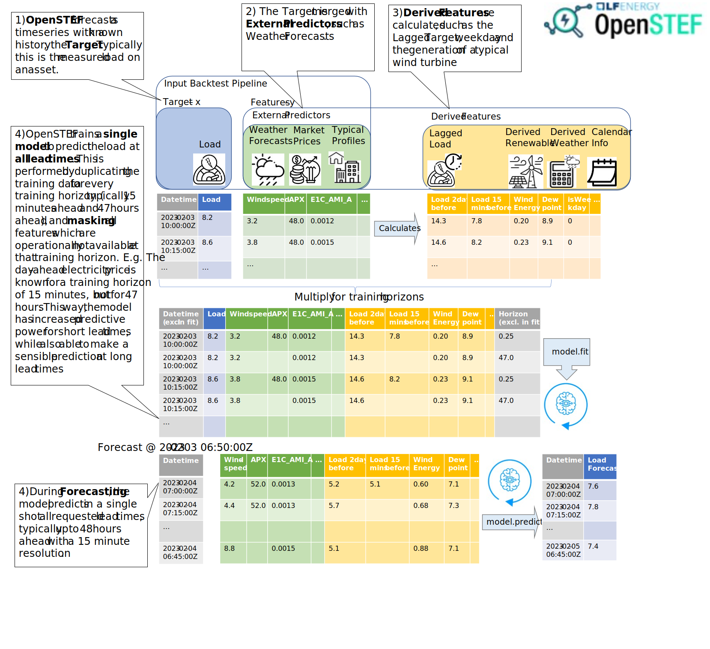

.. comment:
    SPDX-FileCopyrightText: 2017-2022 Contributors to the OpenSTEF project <openstef@lfenergy.org>
    SPDX-License-Identifier: MPL-2.0

High level methodology OpenSTEF
============================================================

OpenSTEF automates many typical activities in machine learning.
These include the combination of input data and preparation of features.
Furthermore, the train and predict methodology of OpenSTEF allows
for a single-shot, multi-horizon forecast. To provide a high-level overview
of these functionalities, a schematic depiction is given here. 

`Source file <_static/methodology_train_predict.pptx>`__

OpenSTEF provides confidence estimates of it's forecasts. 
Two methods are available. The figure below explains the differences
and similarities between the two methods, as well as provide recommendations
on how to the confidence estimations should be used.

.. figure:: _static/uncertainty_estimation.svg
   :alt: Uncertainty estimation
`Source file <_static/methodology_train_predict.pptx>`__
