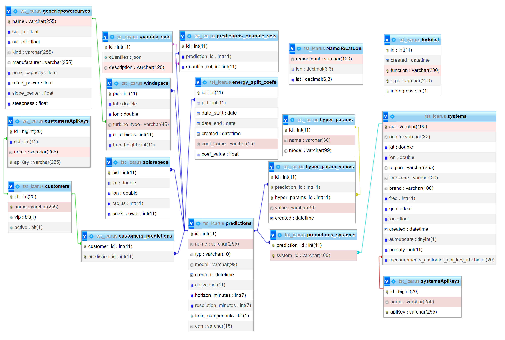

.. comment:
    SPDX-FileCopyrightText: 2017-2023 Contributors to the OpenSTEF project <korte.termijn.prognoses@alliander.com>
    SPDX-License-Identifier: MPL-2.0

Overview of relational database
============================================================

OpenSTEF uses a relational database to store information about prediction jobs and measurements. An ER diagram of this database is shown below.

The necessary tables are described in more detail bellow:

customers
-------------
+----------------+----------+-----------------------+-----------------+
| **Name**       | **Type** | **Comment**           | **Example**     |
+================+==========+=======================+=================+
| id             | int      | customer id           | 307             |
+----------------+----------+-----------------------+-----------------+
| name           | chr      | customer name         | Location_A      |
+----------------+----------+-----------------------+-----------------+
| vip            | bool     | extra important       | 1               |
|                |          | forecast (deprecated) |                 |
+----------------+----------+-----------------------+-----------------+
| active         | bool     | activity status       | 1               |
+----------------+----------+-----------------------+-----------------+

**Customer** : A customer is a collection of predictions. This can be a collection of predictions belonging to a customer but also a collection of prediction belonging to a specific location or substation.

customersApiKeys
----------------
+----------------+----------------+-----------------+-----------------+
| **Name**       | **Type**       | **Comment**     | **Example**     |
+================+================+=================+=================+
| id             | int            | API key id      | 94              |
+----------------+----------------+-----------------+-----------------+
| cid            | int            | customer id     | 307             |
+----------------+----------------+-----------------+-----------------+
| name           | chr            | customer name   | Location_A      |
+----------------+----------------+-----------------+-----------------+
| apiKey         | chr            | API key value   | uuid-Location_A |
+----------------+----------------+-----------------+-----------------+

For users to post measurements or retrieve forecasts related to a
specific customer (used internally by Alliander).

**customers_predictions**

Correspondence table between customer ids and prediction jobs ids.

+--------------------+-----------+-----------------------+-------------+
| **Name**           | **Type**  | **Comment**           | **Example** |
+====================+===========+=======================+=============+
| customer_id        | int       | customer id           | 307         |
+--------------------+-----------+-----------------------+-------------+
| prediction_id      | int       | prediction job id     | 313         |
+--------------------+-----------+-----------------------+-------------+

genericpowercurves
----------------------
Contains the generic load curves of wind turbines. These curves are
two-parameters sigmoids (center and slope).

+---------------+------------+-------------------------+----------------+
| **Name**      | **Type**   | **Comment**             | **Example**    |
+===============+============+=========================+================+
| name          | chr        | turbine name            | Vestas V112    |
+---------------+------------+-------------------------+----------------+
| cut_in        | float      | min wind speed to       | 3              |
|               |            | produce (m/s)           |                |
+---------------+------------+-------------------------+----------------+
| cut_off       | float      | max wind speed to       | 25             |
|               |            | produce (m/s)           |                |
+---------------+------------+-------------------------+----------------+
| kind          | chr        | onshore / offshore      | onshore        |
+---------------+------------+-------------------------+----------------+
| manufacturer  | chr        |                         | Enercon        |
+---------------+------------+-------------------------+----------------+
| peak_capacity | float      | max power (W)           | 3040270        |
+---------------+------------+-------------------------+----------------+
| rated_power   | float      | rated power (W)         | 3000000        |
+---------------+------------+-------------------------+----------------+
| slope_center  | float      | Wind speed              | 7.91           |
|               |            | corresponding to 50% of |                |
|               |            | rated power (m/s)       |                |
+---------------+------------+-------------------------+----------------+
| steepness     | float      | See formula             | 0.76           |
+---------------+------------+-------------------------+----------------+

In openstef/feature_engineering/weather_features.py, the power delivered
by a wind turbine is computed as

.. math:: P(v) = \frac{P_{rated}}{1 + e^{- k(v - c)}},

where :math:`v` is the windspeed at hub height, :math:`P_{rated}` =
rated_power, :math:`k` = steepness and :math:`c` = slope_center.

NameToLatLon
------------
+----------------+-----------+-----------------+----------------------+
| **Name**       | **Type**  | **Comment**     | **Example**          |
+================+===========+=================+======================+
| regionInput    | chr       | region name     | Leeuwarden           |
+----------------+-----------+-----------------+----------------------+
| lon            | decimal   | longitude       | 5.800                |
+----------------+-----------+-----------------+----------------------+
| lat            | decimal   | latitude        | 53.201               |
+----------------+-----------+-----------------+----------------------+

This table is used for looking up coordinates for specific locations that can be used directly for retrieving weather data.

predictions
-----------
Contains prediction jobs.

+---------------------+-----------+------------------------------------------------------------------------------------------------------------------------------------------------------+--------------------+
| **Name**            | **Type**  | **Comment**                                                                                                                                          | **Example**        |
+=====================+===========+======================================================================================================================================================+====================+
| id                  | int       | prediction job id                                                                                                                                    | 313                |
+---------------------+-----------+------------------------------------------------------------------------------------------------------------------------------------------------------+--------------------+
| name                | chr       | customer name                                                                                                                                        | Location_A         |
+---------------------+-----------+------------------------------------------------------------------------------------------------------------------------------------------------------+--------------------+
| forecast_type       | chr       | type of forecast                                                                                                                                     | demand             |
+---------------------+-----------+------------------------------------------------------------------------------------------------------------------------------------------------------+--------------------+
| model               | chr       | type of model                                                                                                                                        | xgb                |
+---------------------+-----------+------------------------------------------------------------------------------------------------------------------------------------------------------+--------------------+
|  created            |  datetime |  creation datetime of                                                                                                                                |  2019-05-16        |
|                     |           |  the prediction job                                                                                                                                  |  14:53:38          |
+---------------------+-----------+------------------------------------------------------------------------------------------------------------------------------------------------------+--------------------+
| active              | int       | 0 = off; 1 = on;                                                                                                                                     |                    |
+---------------------+-----------+------------------------------------------------------------------------------------------------------------------------------------------------------+--------------------+
|  horizon_minutes    |  int      |  max forecast horizon                                                                                                                                |  2880              |
|                     |           |  (minutes)                                                                                                                                           |                    |
+---------------------+-----------+------------------------------------------------------------------------------------------------------------------------------------------------------+--------------------+
|  resolution_minutes |  int      |  time resolution of                                                                                                                                  |  15                |
|                     |           |  forecasts (minutes)                                                                                                                                 |                    |
+---------------------+-----------+------------------------------------------------------------------------------------------------------------------------------------------------------+--------------------+
| train_components    | bool      | Optional: Carry out energy splitting for this prediction job                                                                                         | 1                  |
+---------------------+-----------+------------------------------------------------------------------------------------------------------------------------------------------------------+--------------------+
| ean                 | chr       | EAN of the connectionpoint if the prediction corresponds to a connection point. See also: https://en.wikipedia.org/wiki/International_Article_Number | 000000000000000003 |
+---------------------+-----------+------------------------------------------------------------------------------------------------------------------------------------------------------+--------------------+

**Prediction**: A prediction is the core concept in openSTEF and largley translate to the prediction_job in the openSTEF code. To make a prediction a prediction is usualy coupled to one or more systems. These systems provide the measurement data for which a forecast is made.

predictions_quantiles_sets
--------------------------
Correspondence table between prediction jobs and the set of quantiles to
forecast.

+-----------------+---------+--------------------------+-----------------+
| **Name**        | **Type**| **Comment**              | **Example**     |
+=================+=========+==========================+=================+
| id              | int     |                          | 22              |
+-----------------+---------+--------------------------+-----------------+
| prediction_id   | int     | prediction job id        | 313             |
+-----------------+---------+--------------------------+-----------------+
| quantile_set_id | int     | id of the quantile sets  | 1               |
+-----------------+---------+--------------------------+-----------------+

predictions_systems
-------------------
Correspondence table between prediction jobs and systems.

+---------------+----------+---------------------------------------------+---------------------+
| **Name**      | **Type** | **Comment**                                 | **Example**         |
+===============+==========+=============================================+=====================+
| prediction_id | int      | prediction job id                           | 317                 |
+---------------+----------+---------------------------------------------+---------------------+
| system_id     | chr      | system id                                   | Location_A_System_1 |
+---------------+----------+---------------------------------------------+---------------------+
| factor        | double   | Optional factor to multiply before addition | -2.0                |
+---------------+----------+---------------------------------------------+---------------------+

-  A **prediction job** can correspond to multiple **systems** 

-  A **system** can be linked to multiple **prediction jobs** 

-  When mulitple systems are coupled to a prediction all these systems are added and the forecast is made for the sum. I ffor whatever reason a system should not be added but subtracted it is possible to set the factor to -1. Is some scaling needs to be carried out in the sum the factor can be changed from 1 (default) to the desired scaling factor.

**System** : Represents a physical measurement system. All metadata is saved in this SQL table, the actual timeseries can be retrieved from influx by the corresponding system id.  

quantiles_sets
---------------
Contains the specifications of the quantile sets.

+----------------+----------+------------------+-------------------------+
| **Name**       | **Type** | **Comment**      | **Example**             |
|                |          |                  |                         |
+================+==========+==================+=========================+
| id             | int      | quantile set id  |                         |
+----------------+----------+------------------+-------------------------+
| quantiles      | json     | list of          | [0.05, 0.1, 0.3, 0.5,   |
|                |          | quantiles        | 0.7, 0.9, 0.95]         |
+----------------+----------+------------------+-------------------------+
| description    | chr      |                  | Default quantile set    |
+----------------+----------+------------------+-------------------------+

solarspecs
----------
Configuration for PV forecasts for each prediction job

+------------+----------+-------------------+-------------+
| **Name**   | **Type** | **Comment**       | **Example** |
+============+==========+===================+=============+
| pid        | int      | prediction job id | 123         |
+------------+----------+-------------------+-------------+
| lat        | double   | latitude          | 51.9850343  |
+------------+----------+-------------------+-------------+
| lon        | double   | longitude         | 5.8956792   |
+------------+----------+-------------------+-------------+
| radius     | int      | radius in km      | 10          |
+------------+----------+-------------------+-------------+
| peak_power | int      | max power         | 1000        |
+------------+----------+-------------------+-------------+

2 cases:

-  Radius = ‘None’ : when the forecast is for a specific system

-  Radius > 0 when the forecast is for a region

systems
---------
Contains informations about **systems**.

+-----------------------------------+-----------+-----------------------+---------------------+
| **Name**                          | **Type**  | **Comment**           | **Example**         |
+===================================+===========+=======================+=====================+
| sid                               | chr       | system id             | Location_A_System_1 |
+-----------------------------------+-----------+-----------------------+---------------------+
|  origin                           |  chr      |  origin of the        |  ems (energy        |
|                                   |           |  system data          |  management         |
|                                   |           |                       |  system =           |
|                                   |           |                       |  SCADA)             |
+-----------------------------------+-----------+-----------------------+---------------------+
| lat                               | double    | latitude              | 5.837               |
+-----------------------------------+-----------+-----------------------+---------------------+
| lon                               | double    | longitude             | 51.813              |
+-----------------------------------+-----------+-----------------------+---------------------+
| region                            | chr       |                       |Gelderland           |
+-----------------------------------+-----------+-----------------------+---------------------+
| timezone                          | chr       |                       |UTC                  |
+-----------------------------------+-----------+-----------------------+---------------------+
|  brand                            |  chr      |  additional           |accurate_inc         |
|                                   |           |  information          |                     |
|                                   |           |  on                   |                     |
|                                   |           |  measurements         |                     |
+-----------------------------------+-----------+-----------------------+---------------------+
|  freq                             |  int      |  additional           |5                    |
|                                   |           |  information          |                     |
|                                   |           |  on                   |                     |
|                                   |           |  measurements         |                     |
+-----------------------------------+-----------+-----------------------+---------------------+
|  qual                             |  float    |  additional           |1                    |
|                                   |           |  information          |                     |
|                                   |           |  on                   |                     |
|                                   |           |  measurements         |                     |
+-----------------------------------+-----------+-----------------------+---------------------+
|  lag                              |  float    |  additional           |15                   |
|                                   |           |  information          |                     |
|                                   |           |  on                   |                     |
|                                   |           |  measurements         |                     |
+-----------------------------------+-----------+-----------------------+---------------------+
|  created                          |  datetime |  Date when the system |2021-01-25 09:44:00  |
|                                   |           |  is registred         |                     |
|                                   |           |  in openSTEF          |                     |
+-----------------------------------+-----------+-----------------------+---------------------+
| autoupdate                        | tinyint   | deprecated            | 1                   |
+-----------------------------------+-----------+-----------------------+---------------------+
|  polarity                         |  int      |  sign                 |  -1/1               |
|                                   |           |  convention           |                     |
|                                   |           |  for                  |                     |
|                                   |           |  production           |                     |
|                                   |           |  and load             |                     |
+-----------------------------------+-----------+-----------------------+---------------------+
|  measurements_customer_api_key_id |  int      |  API to post          |  199                |
|                                   |           |  measurements         |                     |
+-----------------------------------+-----------+-----------------------+---------------------+

**Polarity** is a factor used to make the measurment comply with positive consumption and negative production of energy.

systemsApiKeys
------------------
API key to retrieve systems measurements.

+----------------+----------------+-----------------+-------------------+
| **Name**       | **Type**       | **Comment**     | **Example**       |
+================+================+=================+===================+
| id             | int            | API key id      | 199               |
+----------------+----------------+-----------------+-------------------+
| name           | chr            |                 | Measurements      |
+----------------+----------------+-----------------+-------------------+
| apiKey         | chr            | API key value   | uuid-Measurements |
+----------------+----------------+-----------------+-------------------+

todolist
---------

+----------------------+-------------+----------------+----------------+
| **Name**             | **Type**    | **Comment**    | **Example**    |
+======================+=============+================+================+
| id                   | int         | id of the job  |                |
+----------------------+-------------+----------------+----------------+
| created              | datetime    |                |                |
+----------------------+-------------+----------------+----------------+
| function             | chr         | functions to   |                |
|                      |             | execute        |                |
+----------------------+-------------+----------------+----------------+
| args                 | chr         | arguments of   |                |
|                      |             | the functions  |                |
+----------------------+-------------+----------------+----------------+
| inprogress           | int         |                |                |
+----------------------+-------------+----------------+----------------+

The todolist table stores jobs that are picked up by the tracy procces that is run every 5 minutes via a CRON job. This makes it possible to run pipelines manually by adding the respective job to the todo list.

weatherforecastlocations
------------------------
Contains the locations of the weather stations. These are used when retrieving weather data for a prediction.

+----------------+----------------+-----------------+-----------------+
| **Name**       | **Type**       | **Comment**     | **Example**     |
+================+================+=================+=================+
| created        | datetime       |                 | 2023-06-08      |
|                |                |                 | 18:26:44        |
+----------------+----------------+-----------------+-----------------+
| input_city     | chr            |                 | Deelen          |
+----------------+----------------+-----------------+-----------------+
| lat            | double         |                 | 52.067          |
+----------------+----------------+-----------------+-----------------+
| lon            | double         |                 | 5.8             |
+----------------+----------------+-----------------+-----------------+
| country        | chr            |                 | NL              |
+----------------+----------------+-----------------+-----------------+
| active         | int            |                 | 1               |
+----------------+----------------+-----------------+-----------------+

windspecs
---------
This table is empty in openstef-reference. Contains the information for
the wind power forecast related to a prediction job.

+--------------+--------------+-------------------------+-------------+
| **Name**     | **Type**     | **Comment**             | **Example** |
+==============+==============+=========================+=============+
| pid          | int          | prediction job id       |             |
+--------------+--------------+-------------------------+-------------+
| lat          | double       |                         |             |
+--------------+--------------+-------------------------+-------------+
| lon          | double       |                         |             |
+--------------+--------------+-------------------------+-------------+
| turbine_type | chr          | corresponds to the      |             |
|              |              | field ‘name’ in         |             |
|              |              | genericpowercurves      |             |
+--------------+--------------+-------------------------+-------------+
| n_turbines   | int          | number of wind turbines |             |
+--------------+--------------+-------------------------+-------------+
| hub_height   | int          | height of the turbines  |             |
|              |              | (m)                     |             |
+--------------+--------------+-------------------------+-------------+

The hub height is used to extrapolate the wind speed forecast at the
correct height.
